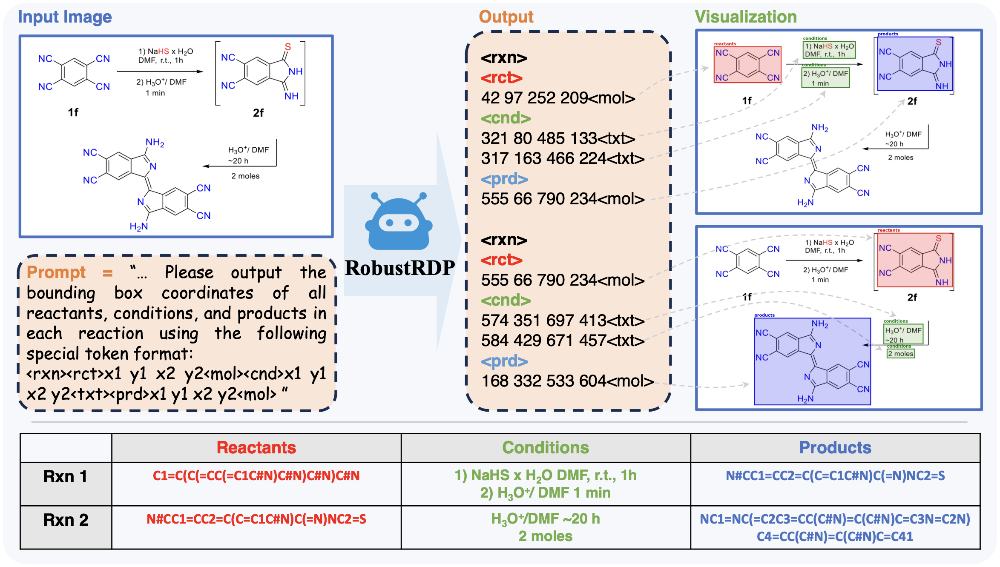

<h1 align="center">RobustRDP: Advancing Reaction Diagram Parsing via<br>Synthetic-to-Real Data Scaling and Robustness-Oriented Training</h1>
<p align="center">
  <br>
  
  <a href="https://arxiv.org/abs/"></a>
  <a href="https://huggingface.co/Jingcz/RobustRDP"></a>
  <a href="https://huggingface.co/datasets/Jingcz/RobustRDP-ProcessedTrainData"></a>
  <a href="https://huggingface.co/datasets/Jingcz/RobustRDP-ProcessedValData"></a>
  <a href="./LICENSE"></a>
</p>
<p align="center">
  
</p>

This repository contains the official training and evaluation code for **RobustRDP**, a robust approach for chemical reaction diagram parsing that leverages:

- 🚀 **Synthetic-to-real data scaling** — Large-scale synthetic pretraining (60k images) followed by real-world fine-tuning
- 🛡️ **Robustness-oriented training** — Multi-task SFT with region-guided and prefix-perturbed objectives, plus DPO alignment

The model is built upon **Qwen2.5-VL-3B-Instruct** and trained using **LLaMA-Factory**.

---

## Table of Contents

- [Environment Setup](#environment-setup)
- [Quick Evaluation](#quick-evaluation)
- [Training RobustRDP](#training-robustrdp)
- [Training Data Generation](#training-data-generation)
- [Evaluation Data Generation](#evaluation-data-generation)
- [Efficient Annotation Platform](#efficient-annotation-platform)
- [Citation](#citation)

---

## Environment Setup

### 1. Create a Conda Environment

```bash
conda create -n robustrdp python=3.11.13
conda activate robustrdp
```

### 2. Clone This Repository

```bash
git clone https://github.com/jaydetang/RobustRDP.git
cd RobustRDP
pip install -r requirements.txt
```

### 3. Clone and Patch LLaMA-Factory

```bash
git clone https://github.com/hiyouga/LLaMA-Factory.git
cd LLaMA-Factory
git checkout v0.9.4
pip install -e .
git apply ../llamafactory_patch/patch.diff
cd ..
```

The patch registers the custom datasets (`stage1_pretrain`, `stage2_sft`, `stage3_dpo`) into LLaMA-Factory's dataset_info.json, and adds support for the `disturb_rxns` field used in perturbed reaction parsing during SFT.

---

## Quick Evaluation

Evaluate the trained RobustRDP model on both the **RxnScribe test** and **RobustRDP test** sets.

### Step 1: Download the Model

Download the trained model checkpoint from Hugging Face and place it under the `eval/` directory:

```bash
huggingface-cli download Jingcz/RobustRDP --local-dir ./eval/SFT_Model
```

### Step 2: Download the Validation Data

Download the processed validation data from Hugging Face:

```bash
huggingface-cli download Jingcz/RobustRDP-ProcessedValData --local-dir ./processed_val_data --repo-type dataset
```

The validation data includes two test sets:
- **`RxnScribe_test/`** — Test set converted from the [RxnScribe](https://github.com/thomas0809/RxnScribe) benchmark
- **`RobustRDP_test/`** — Test set constructed for RobustRDP with diverse layouts and reaction types

> See [processed_val_data/README.md](processed_val_data/README.md) for detailed data specifications.

### Step 3: Run Evaluation

```bash
# Make sure you have updated the model path in eval/eval.sh to point to your downloaded checkpoint
sh eval/eval.sh
```

The script evaluates both test sets sequentially using 8 GPUs with distributed data parallel inference. Results (predictions and scores) are saved to `eval/dpo_results/`.

> **Note**: The `eval.sh` script assumes 8 GPUs are available. Adjust `CUDA_VISIBLE_DEVICES` and `nproc_per_node` in the script if using fewer GPUs.


---

## Training RobustRDP

Training consists of three sequential stages, each building upon the previous one. The original experiments were conducted on **2 × NVIDIA H100 (80GB) GPUs**.

> **⚠️ Important:** All training commands below must be executed from the **`RobustRDP/`** project root directory (i.e., the directory containing this `README.md`). The `train_scripts/`, `PLMs/`, `processed_train_data/`, and `saves/` paths are all relative to this root.

### Step 1: Download the Base Model

```bash
# Download Qwen2.5-VL-3B-Instruct from Hugging Face
huggingface-cli download Qwen/Qwen2.5-VL-3B-Instruct --local-dir ./PLMs/Qwen2.5-VL-3B-Instruct
```

### Step 2: Download the Training Data

```bash
# Download the processed training data from Hugging Face
huggingface-cli download Jingcz/RobustRDP-ProcessedTrainData --local-dir ./processed_train_data --repo-type dataset
```

The training data includes three subsets:
- **`pretrain_data/`** — 60,000 synthetic reaction diagrams (single-line, multi-line, branch, cycle)
- **`sft_data/`** — Multi-task SFT data with real-world diagrams and augmentations
- **`dpo_data/`** — DPO preference pairs

> See [processed_train_data/README.md](processed_train_data/README.md) for detailed data specifications.

### Step 3: Stage 1 — Pretraining

```bash
llamafactory-cli train train_scripts/qwen2_5vl_3b_pretrain.yaml
```

- **Base model**: `./PLMs/Qwen2.5-VL-3B-Instruct`
- **Dataset**: 60k synthetic reaction diagrams
- **Training config**: Full fine-tuning of language model, frozen vision tower & projector
- **Output**: `saves/stage1_pretrain/qwen2_5vl-3b/pretrainllm_lr1e-6_bs16_cosine_6w/`
- **Special tokens**: `<rxn>`, `<rct>`, `<cnd>`, `<prd>`, `<txt>`, `<mol>`

> **Select the final checkpoint** (e.g., `.../final`) for the next stage.

### Step 4: Stage 2 — Multi-Task SFT

Update `model_name_or_path` in `train_scripts/qwen2_5vl_3b_sft.yaml` to point to the final checkpoint from Stage 1, then run:

```bash
llamafactory-cli train train_scripts/qwen2_5vl_3b_sft.yaml
```

- **Dataset**: Multi-task SFT data including:
  - Vanilla Reaction Parsing (VRP) — standard parsing with augmentation
  - Region-Guided Reaction Parsing (RGRP) — parse within specified bounding-box regions
  - Prefix-Perturbed Reaction Parsing (PPRP) — parsing with some equations perturbed
- **Training config**: Full fine-tuning of all parameters
- **Output**: `saves/stage2_sft/qwen2_5vl-3b/pretrainllm_sftall_lr1e-5_bs4_cosine_decouple_disturb_15d/`

> **Select the final checkpoint** (e.g., `.../checkpoint-47700`) for the next stage.

### Step 5: Stage 3 — DPO Alignment

Update `model_name_or_path` in `train_scripts/qwen2_5vl_3b_dpo.yaml` to point to the selected checkpoint from Stage 2, then run:

```bash
llamafactory-cli train train_scripts/qwen2_5vl_3b_dpo.yaml
```

- **Dataset**: DPO preference pairs (14,169 samples), chosen = ground truth, rejected = model prediction with F1 < 0.8
- **Training config**: Frozen vision tower & projector, language model only
- **DPO hyperparameters**: `pref_beta=0.1`, `pref_ftx=0.5`, `pref_loss=sigmoid`
- **Output**: `saves/stage3_dpo/qwen2_5vl-3b/dpollm_lr3e-7_bs64_cosine_beta01_ftx05/`

---

## Training Data Generation

### Pretrain Data (LayoutDrivenSynthesizer)

Scripts to synthesize 60,000 chemical reaction diagrams with four layout types:

| Layout Type     | Count    | Description                      |
|-----------------|----------|----------------------------------|
| Single-line     | 10,000   | Single-line chain-style reactions |
| Multi-line      | 10,000   | Multi-line chain-style reactions  |
| Branch          | 20,000   | Branching reactions               |
| Cycle           | 20,000   | Cyclic reactions                  |

> See [pretrain_data_process/README.md](pretrain_data_process/README.md) for full instructions.

### SFT Data (Multi-Task Supervised Fine-Tuning)

Generates multi-task training data from 4,240 real-world reaction diagrams with three task variants:

| Task                                 | Samples   | Description                                        |
|--------------------------------------|-----------|----------------------------------------------------|
| Vanilla Reaction Parsing (VRP)       | 127,200   | Standard parsing with augmentation (x15)           |
| Region-Guided Reaction Parsing (RGRP)| 31,800    | Parse reactions within a given bounding-box region |
| Prefix-Perturbed Reaction Parsing (PPRP) | 31,800 | Parse with some equations having perturbed boxes   |

> See [sft_data_process/README.md](sft_data_process/README.md) for full instructions.

### DPO Data (Direct Preference Optimization)

Generates 14,169 preference pairs by running the Stage 2 SFT model on the VRP training data and filtering samples where model predictions have an overall F1 < 0.8 compared to ground truth.

> See [dpo_data_process/README.md](dpo_data_process/README.md) for full instructions.

---

## Evaluation Data Generation

Scripts to process raw validation data into the evaluation format used by RobustRDP:

```bash
# Step 1: Download raw validation data
huggingface-cli download Jingcz/RobustRDP-RawValData --local-dir ./raw_val_data --repo-type dataset

# Step 2: Process RxnScribe test data
python raw_val_data/gen_processed_val_data_rxnscribe_test.py

# Step 3: Process RobustRDP test data
python raw_val_data/gen_processed_val_data_robustrdp_test.py
```

> See [raw_val_data/README.md](raw_val_data/README.md) for full instructions.

---

## Efficient Annotation Platform

The **Efficient Annotation Platform** used to annotate the 3,500 raw reaction diagrams (the foundation of the SFT and DPO data) is available at:

- **Repository**: [RxnLabel — https://github.com/jaydetang/RxnLabel](https://github.com/jaydetang/RxnLabel)
- **Raw Annotated Data**: [Jingcz/RxnLabelData on Hugging Face](https://huggingface.co/datasets/Jingcz/RxnLabelData)

The platform enables efficient bounding-box and reaction structure annotation for chemical diagrams, supporting the data generation pipeline described in the paper.


---

## Project Structure

```
RobustRDP/
├── LLaMA-Factory/                    # Cloned & patched LLaMA-Factory (v0.9.4)
├── llamafactory_patch/               # Patch to register custom datasets in LLaMA-Factory
│   └── patch.diff
├── PLMs/                             # Pre-trained language models (Qwen2.5-VL-3B-Instruct)
├── saves/                            # Training checkpoints (generated during training)
├── train_scripts/                    # LLaMA-Factory training configs (YAML)
│   ├── qwen2_5vl_3b_pretrain.yaml
│   ├── qwen2_5vl_3b_sft.yaml
│   └── qwen2_5vl_3b_dpo.yaml
├── eval/                             # Evaluation scripts & model checkpoint
│   ├── eval.sh                       # Main evaluation script
│   ├── eval_multigpu.py              # Distributed evaluation
│   ├── evaluater.py                  # Evaluation metrics
│   └── data.py                       # Data loading for evaluation
├── processed_train_data/             # Training data (download from Hugging Face)
│   ├── pretrain_data/                # 60k synthetic diagrams
│   ├── sft_data/                     # Multi-task SFT data
│   └── dpo_data/                     # DPO preference pairs
├── processed_val_data/               # Validation data (download from Hugging Face)
│   ├── RxnScribe_test/
│   └── RobustRDP_test/
├── raw_val_data/                     # Raw validation data processing
│   ├── gen_processed_val_data_rxnscribe_test.py
│   ├── gen_processed_val_data_robustrdp_test.py
│   ├── RobustRDP_test/               # Raw RobustRDP test images
│   ├── RxnScribe_test/               # Raw RxnScribe test images
│   └── utils/
├── pretrain_data_process/            # Synthetic pretrain data generation
│   ├── gen_single_line.py
│   ├── gen_multi_line.py
│   ├── gen_branch.py
│   ├── gen_cycle.py
│   ├── post_process.py
│   ├── utils.py
│   ├── indigo/                       # Indigo cheminformatics wrapper
│   └── raw_data/
├── sft_data_process/                 # SFT data generation
│   ├── gen_vanilla_reaction_parsing.py
│   ├── gen_region_guided_reaction_parsing.py
│   ├── gen_prefix_perturbed_reaction_parsing.py
│   ├── post_process.py
│   ├── raw_data/
│   └── utils/
└── dpo_data_process/                 # DPO data generation
    ├── pre_process.py
    ├── gen_dpo.py
    └── gen_dpo.sh
```

---

## Citation

If you find this work useful in your research, please consider citing our paper:

```bibtex
@article{robustrdp2025,
  title={RobustRDP: Advancing Reaction Diagram Parsing via Synthetic-to-Real Data Scaling and Robustness-Oriented Training},
  author={...},
  journal={...},
  year={2025}
}
```

---

## License

This project is licensed under the MIT License — see the LICENSE file for details.
